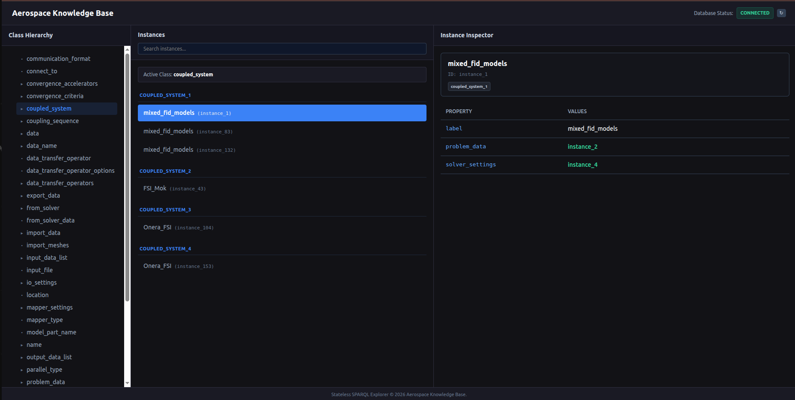

# GraphDB Migration Quickstart

Follow these steps to set up the GraphDB-backed REST API and verify the integration workflows.

---

## 1. Database Setup
1. Download and run [GraphDB](https://graphdb.ontotext.com/) locally (default URL is `http://localhost:7200`).
2. Open the GraphDB Workbench in your browser, go to **Setup** -> **Repositories** -> **Create new repository**.
3. Create a repository with **Repository ID** set to `coupled_modelling` (use default settings for the rest).

---

## 2. Configuration & Environment Variables
The application automatically configures itself, but you can override connection settings via the following environment variables:
* `GRAPHDB_URL` (default: `http://localhost:7200`) — The URL of the GraphDB server instance.
* `GRAPHDB_REPOSITORY` (default: `coupled_modelling`) — The active repository ID.
* `GRAPHDB_USER` / `GRAPHDB_PASSWORD` — Credentials to authenticate against GraphDB (if basic authentication is enabled).

---

## 3. Installation & Running
1. Install Python dependencies:
   ```bash
   pip install -r backend/requirements.txt
   pip install -r coupled_modelling/requirements.txt
   pip install -e .
   ```
2. Start the local Flask API server:
   ```bash
   python backend/api.py
   ```

---

## 4. Accessing the Web Explorer & Editor UI

Once the Flask API server is running (started via `python backend/api.py`), access the Web Explorer & Editor interface:

1. Open your web browser and navigate to:
   `http://localhost:5000/`

   

2. **Features of the Web Interface:**
   * **Database Status Indicator (Top Bar):** Shows the real-time health of the GraphDB repository connection (Connected vs. Offline).
   * **Global Instance Search (Top Bar):** Auto-completing search bar allowing fast cross-class instance search and instant navigation.
   * **Class Hierarchy Pane (Left Column):** Explore the ontology schema class tree. Clicking a class name selects the class and automatically expands its sub-classes.
   * **Class Inspector & Instances Pane (Middle Column):** Displays class metadata, parent/sub-classes, and asserted restriction axioms (`owl:Restriction`). Lists class instances with compact inline property previews so autogenerated instances (e.g. `instance_105`) can be easily distinguished.
   * **Instance Inspector Pane (Right Column):** Displays selected instance metadata, property key-value grid table, inline double-click property editing, trash icon property deletions, and a red **Delete Instance** button for full cascading node deletion.
   * **Import & Export Actions:** Single-click OWL download button, Kratos JSON import modal dialog, and Kratos JSON export.
   * **Semantic Navigation:** Linked object properties (displayed in green) act as clickable navigation links to trace relationships interactively.

---

## 5. Initializing the Database & Running Demos

Once the API server is active, populate the database with the core ontology schema and co-simulation instances:

1. **Populate the Database:**
   ```bash
   python backend/test.py
   ```
   *(This loads the base co-simulation schema, creates the initial solvers and criteria, and writes the reference ontology file `examples/test.owl`)*

2. **Verify with the Workflow Demo:**
   ```bash
   python examples/demo_api.py
   ```
   *(This validates the client API interactions by building and exporting a complete co-simulation setup to `examples/export_onera_fsi.json`)*

---

## 6. Running the Test Suite

After the database has been initialized with the base schema, you can run the test suite to verify the integrity of the RDF serialization, SPARQL update pathways, and web endpoints. 

To run the tests without namespace shadowing conflicts (e.g., from other global test libraries), run the following command:

```bash
PYTHONPATH=. python -m unittest discover -s tests -p "test_*.py" -v
```

The SPARQL integration tests require a running GraphDB instance and modify repository data. Use a dedicated test repository where possible.

### Purpose of the Tests:
* `test_serialization.py`: Validates SPARQL/RDF term serialization and local resource name validation.
* `test_sparql_mutations.py`: Tests the execution of SPARQL-based updates (inserting, deleting, and replacing properties on existing subjects).
* `test_sparql_creation.py`: Tests direct instance instantiation, class validation against GraphDB, and safe prefix-isolated test teardowns.
* `test_web_explorer.py`: Tests Flask routing contracts, health error mapping (503/400), tree inheritance parsing, and global search.
* `test_web_mutations.py`: Tests web mutation endpoints (`/delete_value/`, `/create_class_instance/`, `/download_owl/`, `/delete_instance/`), boolean string parsing safety, and GraphDB error codes.

---

## 7. Architecture: Hybrid Owlready2 + GraphDB
* **Direct SPARQL mutations:** Simple value insertions, deletions, replacements, instance creation (UUID-based), and full instance deletion run directly in GraphDB via transactional SPARQL Update requests.
* **In-memory Owlready2 workflows:** Copy operations, complex ontology construction, KRATOS JSON import/export, and structural inference continue to use Owlready2 and synchronize with GraphDB.
